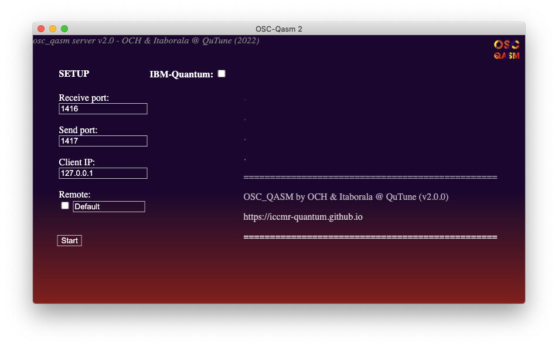
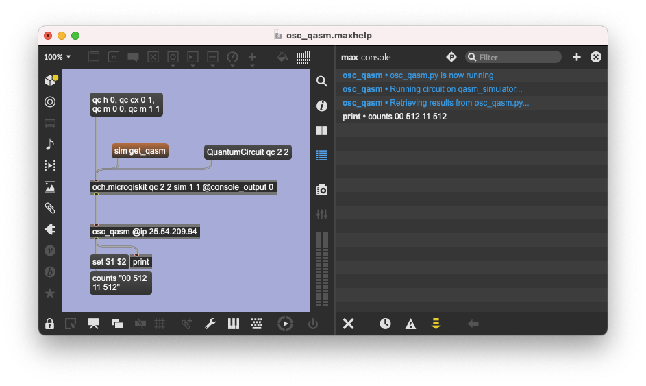
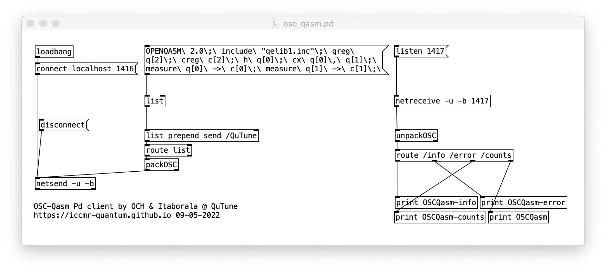

# OSC-Qasm
[](https://zenodo.org/badge/latestdoi/432225522)

A simple multi-platform OSC Python interface for executing Qasm code. Or a simple way to connect creative programming environments like Max ([_The QAC Toolkit_](https://quantumland.art/qac)) and Pd with real quantum hardware, using the OSC protocol. Please click the  icon on the top left corner of this Readme.md file viewer on [github](https://github.com/iccmr-quantum/OSC-Qasm/) to access the table of contents.

## Running Server

With the launch of _OSC-Qasm 2.0_, you can now run the server side in two ways - with the graphical user interface ([GUI](#gui)), or headless with the command line interface ([CLI](#cli)).

### GUI
The GUI implementation requires google chrome browser installed.

If you downloaded the compiled application for your OS from the [releases page](https://github.com/iccmr-quantum/OSC-Qasm/releases) (recommended), simply double click the application icon to launch it.

If you cloned or downloaded the source code, you need to follow the instructions in the [Build](#build) section. Then, you can launch it by simply running `python osc_qasm.py` on your Terminal (Mac/Linux) or Command Prompt (Windows).

Wait until the GUI window opens (it takes several seconds on Windows and Mac):



This graphical user interface presents several input fields that let you easily change the server configuration setup. The checkbox `IBM-Quantum` reveals additional fields that allow the use of [_IBM Quantum_](quantum-computing.ibm.com) credentials to access IBM's real quantum hardware. For more details about all these options, please read the [Additional arguments](#additional-arguments) section.
When you're ready, you can click the `Start` button and you will see the program outputting the following lines:

```console
Server Receiving on 127.0.0.1 port PPPP
Server Sending back on x.x.x.x port QQQQ
```

At this point, you can launch the client application of your choice (see [Running Client](#running-client)) and start sending qasm via OSC to _OSC-Qasm_. Note that the first job usually takes additional time to complete, as some resources need to be loaded.

### CLI

You can also run _OSC-Qasm_ in **headless** mode, with a Command-Line Interface server.
To do so, open a Terminal (Mac/Linux) or Command Prompt (Windows) and go to the location of your downloaded _OSC-Qasm 2_ application, or drag the application file into the console window. Then, run the executable file using the `--headless` flag as described below. Note that Windows has a specific executable file `OSC_Qasm_2_console.exe` (in the [releases page](https://github.com/iccmr-quantum/OSC-Qasm/releases)) for running the **headless** mode properly.

- Mac: add `/Contents/MacOS/OSC_Qasm_2 --headless` to the command, as in:
```console
OSC_Qasm_2.app/Contents/MacOS/OSC_Qasm_2 --headless
```
- Windows
```console
OSC_Qasm_2_console.exe --headless
```
- Linux
```console
./OSC_Qasm_2 --headless
```

The program will now greet you directly in the console with:
```console
================================================
 OSC_QASM by OCH & Itaborala @ QuTune (v2.x.x)
 https://iccmr-quantum.github.io               
================================================
Server Receiving on 127.0.0.1 port PPPP
Server Sending back on x.x.x.x port QQQQ
```

At this point, you can launch the client application of your choice (see [Running Client](#running-client)) and start sending qasm via OSC to _OSC-Qasm_. Note that the first job usually takes additional time to complete, as some resources need to be loaded.

When you're done working with _OSC-Qasm_ you can stop it by pressing `Ctrl+C`.

### Additional arguments
Whether you are running _OSC-Qasm 2_ in **GUI** mode or **CLI** mode, using the compiled application, or building from source, you can configure your server by using some additional arguments and flags. The list below, that you can retrieve from running the `--help` argument, includes a detailed description of each option.

```console
usage: osc_qasm.py [-h] [--token TOKEN] [--hub HUB] [--group GROUP]
                   [--project PROJECT]
                   [receive_port] [send_port] [ip]

positional arguments:
  receive_port            The port where the OSC-Qasm Server will listen for
                          incoming messages. Default port is 1416
  send_port               The port that OSC-Qasm will use to send messages back
                          to the Client (the client's listening port). Default
                          port is 1417
  ip                      The IP address to where the retrieved results will be
                          sent to (Where the Client is located). Default IP is
                          127.0.0.1 (localhost)

optional arguments:
  -h, --help              show this help message and exit
  --token TOKEN           If you want to run circuits on real quantum hardware, you
                          need to provide your IBMQ token (see https://quantum-
                          computing.ibm.com/account)
  --hub HUB               If you want to run circuits on real quantum hardware, you
                          need to provide your IBMQ Hub
  --group GROUP           If you want to run circuits on real quantum hardware, you
                          need to provide your IBMQ Group
  --project PROJECT       If you want to run circuits on real quantum hardware, you
                          need to provide your IBMQ Project
  --remote [REMOTE]       Declare this as a remote server. In this case, OSC-Qasm
                          will be listening to messages coming into the network
                          adapter address. If there is a specific network adapter
                          IP you want to listen in, add it as an argument here
  --headless [HEADLESS]   Run OSC-Qasm in headless mode. This is useful if you
                          don't want to launch the GUI and only work in the terminal.
```

To learn more about `--token`, `--hub`, `--group`, and `--project` please visit https://quantum-computing.ibm.com. The `--headless` tag is explained above in the [CLI](#cli) section. The `--remote` tag is further explained in the [Network Distribution](#network-distribution) section below.

### Network Distribution

Version 1.3.0 brought new options for facilitating distributed network scenarios.

You can now have: a client machine (C1) sending `qasm` jobs via OSC (e.g. using [osc_qasm.maxpat](https://github.com/iccmr-quantum/OSC-Qasm/blob/main/osc_qasm-Max/osc_qasm.maxpat)); a different server machine (S1) running _OSC-Qasm_ server, receiving and processing the job requests; and even a third client machine (C2) receiving the results.

```mermaid
flowchart LR
C1 -- qasm --> S1 -- results --> C2
```

To that end, _OSC-Qasm_ has an optional flag/argument called `--remote`. When used, the _OSC-Qasm_ server will listen to the default IP address assigned to the machine for the local area network, instead of "127.0.0.1". Additionally, you can add an argument after the flag to specify the IP address to use (useful in a scenario with multiple network adapters, each giving the machine a different IP address for each network).

Example:

(1)
```console
$ python osc_qasm.py
Server Receiving on 127.0.0.1 port 1416
```

(2)
```console
$ python osc_qasm.py --remote
Server Receiving on 10.0.0.31 port 1416
```

(3)
```console
$ python osc_qasm.py --remote 192.168.0.3
Server Receiving on 192.168.0.3 port 1416
```

The example provided is assuming that you are running _OSC-Qasm_ when building from source (see [Build](#build) section below) but this is equivalent to running _OSC-Qasm 2_ in **headless** mode (see [CLI](#cli) section above). When running _OSC-Qasm 2_ in **GUI** mode, these 3 examples correspond to starting the server (1) without checking the `Remote` checkbox, (2) with `Remote` checkbox checked, and (3) with `Remote` checkbox checked and the input field changed from `Default` to `192.168.0.3`.

#### Connecting worldwide
If you'd like to connect different machines across the internet, you can use their public IP, assuming also that they have open UDP ports or, in the case of a machine inside a network (as in most cases, where you access the internet via a router), they have configured the proper port forwarding. Alternatively, you can use a VPN service like [hamachi](https://vpn.net). A setup example is shown here, with a `osc_qasm.py` server (same as _OSC-Qasm 2_ in **CLI** mode) running on a Linux machine, and a `osc_qasm.maxpat` client running on a MacOS machine. We've tested this setup connecting two machines across the internet, one in Brazil, and another in the UK.

##### Linux Desktop Server
First, you need to [download](https://vpn.net) and install the CLI hamachi client. For manual installation, replace the version below with the most most up-to-date _.deb_ or _.rpm_ file shown [here](https://www.vpn.net/linux).

###### POP!OS/Ubuntu/Debian (.deb)
```console
$ wget https://www.vpn.net/installers/logmein-hamachi_2.1.0.203-1_amd64.deb
$ sudo dpkg -i logmein-hamachi_2.1.0.203-1_amd64.deb
```

###### CentOS/RedHat
```console
$ wget https://www.vpn.net/installers/logmein-hamachi_2.1.0.203-1_amd64.deb
$ sudo rpm -ivh logmein-hamachi-2.1.0.203-1.x86_64.rpm
```

This has limited capabilities, in comparison with the GUI on the Windows and MacOS versions, but the necessary additional configurations for our purpose here can be done on any web browser.

Then, you need to create an account on [LogMeIn](https://accounts.logme.in/registration.aspx). The LogMeIn free account allows the user to setup networks on the [LogMeIn Website](https://accounts.logme.in/login.aspx).

After an account has been created, open a Terminal and log in with your account's email address, using the following commands:

```console
$ sudo hamachi login
Logging in ........... ok
$ sudo hamachi attach email@example.com
```
On the LogMeIn website, under the `My Networks` tab, click the `Add Network` button to create a new network.

<kbd>  </kbd>

Follow the steps shown on the website. In this example we created a "Mesh" type network with the name `OSC-Qasm`.

<kbd>  </kbd>

In step 2, you can configure the security settings of your network, like setting up a password and join requests settings. In step 3, you can add existing members to your network or simply click `Finish` to complete the network creation.

At this point, you can go to the Edit page of this network to copy the `Network ID`, found in the area marked by the red box.

<kbd>  </kbd>

Then, on your Linux Terminal, use the `Network ID` to join the hamachi network you created.

```console
$ sudo hamachi join NETWORK-ID
```

Once configured, you can retrieve the new hamachi network IP address by running

```console
$ sudo hamachi
  version    : 2.1.0.203
  pid        : 1464
  status     : logged in
  client id  : YOUR_CLIENT_ID
  address    : 25.54.209.94   <<<<< This is your hamachi IP address  
  nickname   : pop-os
  lmi account: email@example.com
```

Finally, assuming you also configured your client machine in the hamachi network, you can boot your _OSC-Qasm_ server, using your hamachi network IP address as an argument to the `--remote` flag, and using the client machine's hamachi IP address to send the results.


Next we will show how you can configure your client machine.

##### Client MacOS machine
First, you need to [download](https://vpn.net) and install the hamachi client application. On the new `LogMeIn Hamachi` application, click the power button to enable the hamachi service.


The first time this is done, it will ask you to either log into your _LogMeIn ID_ account or create a new account. At this point the power button will be enabled and you'll be presented with 2 options: `Create Network` and `Join network`.


In this example, since we've created the network in the previous step we will just join the previously created network. It is important to note that the first field is not the network name, but the `Network ID` (retrieved in the LogMeIn website or by hovering the mouse over the network name in the hamachi application). Once everything is set, you should see the new network listed together with its users. The LED in front of each user indicates if they are online or offline. Right clicking an online user in this list will allow you to copy its IP address.


You can now open your max patch (see the [Max](#max) section below) and add an attribute to `osc_qasm` object to specify the target IP address to send requests to. In this example this was done by simply adding `@ip 25.54.209.94` which is the hamachi IP address of the Linux _OSC-Qasm_ server machine configured before.



## Running Client

_OSC-Qasm_ allows you to execute Qasm code by sending it to a server application using the OSC protocol. This is a protocol that is often found in creative programming environments. The first major release of _OSC-Qasm_ shipped only with the Max/MSP client which relies on [_The QAC Toolkit_](http://quantumland.art/qac) Max package to programmatically generate Qasm code. Other clients are being released with _OSC-Qasm 2_ that include very simple examples of how to send Qasm code respecting the _OSC-Qasm_ protocol. You are free to generate Qasm code however you prefer. Currently, for clients other than Max, we recommend checking out the [IBM Quantum Composer](https://quantum-computing.ibm.com) to get started generating Qasm code. Please see the [Feedback and Getting help](#feedback-and-getting-help) section below for more information.

### Max
In order to try the Max client (Mac/Windows only), make sure you have [Max](http://cycling74.com) installed, and [_The QAC Toolkit_](http://quantumland.art/qac) Max package available. You can download the `Client_Max.zip` from the [releases page](https://github.com/iccmr-quantum/OSC-Qasm/releases), or you can simply download (or clone) the entire repository.

After unzipping, you need to either move the `osc_qasm-Max` folder to your Max Library folder (recommended) or add it to your Max search path. The Max Library folder is usually located in your `Documents` folder, under the `Max 8` directory.

Now you can open the `osc_qasm` abstraction in Max 8 to send Qasm code to the _OSC-Qasm_ server. We strongly recommend checking out the help patch, [osc_qasm.maxhelp](osc_qasm-Max/osc_qasm.maxhelp), which gives a complete working demo of using the [osc_qasm.maxpat](osc_qasm-Max/osc_qasm.maxpat) abstraction. Simply build the circuit, and then click the `sim get_qasm` message to programmatically generate the Qasm code and send it to the _OSC-Qasm_ server.

The `osc_qasm` abstraction also allows customization using several attributes and positional arguments. In addition to the help patch, you can also right-click the `osc_qasm` abstraction and open the reference page that includes a very detailed description!


If you'd like to better understand the _OSC-Qasm_ protocol you can take a look at the [client_template.maxpat](client_template.maxpat) example patch.

Please note that, as explained in the [Running Server](#running-server) section above, the first job usually takes additional time to complete, as some resources need to be loaded in the server.

### Pd
In order to try the Pd client, make sure you have [Pd](http://msp.ucsd.edu) installed, and the `osc-v0.2` external available. In order to add the `osc-v0.2` external, you need to navigate to the `Help` menu, and click `Find externals`. Here you can search for `osc` and install `osc-v0.2~git2015...` by rdz.

You can download the `Client_Pd.zip` from the [releases page](https://github.com/iccmr-quantum/OSC-Qasm/releases), or you can simply download (or clone) the entire repository. Now you can open the `osc_qasm` patch in Pd to send Qasm code to the _OSC-Qasm_ server.



We've noted that, on some systems, in order to have the new `osc` external library to load with Pd every time, you might need to add its directory to `Pd > Preferences > Path...` or `Pd > Preferences > Startup...`.

Please also note that, as explained in the [Running Server](#running-server) section above, the first job usually takes additional time to complete, as some resources need to be loaded in the server.

## Build
Before starting, make sure you have [Python](https://www.python.org/) 3.7+ in your system.
- when using the installer on windows make sure to select the option `Add Python X to PATH`

Clone or [download](https://github.com/iccmr-quantum/OSC-Qasm/archive/refs/heads/main.zip) and unzip this repo.

Open the Terminal (Mac/Linux) or Command Prompt (Windows) and navigate to the folder  where you saved the repo.
- see here a refresher on how to navigate using the terminal [[1](https://computers.tutsplus.com/tutorials/navigating-the-terminal-a-gentle-introduction--mac-3855)][[2](https://www.macworld.com/article/221277/command-line-navigating-files-folders-mac-terminal.html)]

Create a python virtual environment
- on the terminal, type: `python3 -m venv OSCQasm`
- depending on your system, you may simply use: `python -m venv OSCQasm`

Enter your new python virtual environment
- on mac/linux: `source OSCQasm/bin/activate`
- on windows: `OSCQasm\Scripts\activate`

At the start of your terminal prompt, it should show `(OSCQasm)`, indicating that you're in your new virtual environment.

Update pip and setuptools
- `pip install --upgrade pip setuptools`
- Note: if for some reason you don't have pip, please [install it](https://phoenixnap.com/kb/install-pip-windows)

Install qiskit, python-osc, eel, and pyinstaller
- `pip install qiskit python-osc eel pyinstaller`

Please note that the **GUI** mode requires google chrome browser to be installed.

You can now run _OSC-Qasm_ from your terminal with:
- `python osc_qasm.py` to launch the GUI mode
- `python osc_qasm.py --headless` to launch the headless module

For more options please refer to the [Additional arguments](#additional-arguments) section above.

To compile the application you will have to run:
- on mac/linux: `pyinstaller osc_qasm_mac.spec`
- on windows: `pyinstaller osc_qasm_windows.spec`

Note: you might need to edit the `.spec` file to make sure lines 3 to 8 correctly refer to valid paths for your current system configuration. More specifically, you might need to change the python version number in the path to match the python version you have in your system. Also, note that you simply need to change line 55 of `osq_qasm_windows.spec` to `console=True,` in order to compile the OSC_Qasm_2_console version for Windows.

After compilation, you will find the app executable under the `dist` directory.

Finally, you can leave the virtual environment with:
- on mac/linux & windows: `deactivate`

## Feedback and Getting help
Please open a [new issue](https://github.com/iccmr-quantum/OSC-Qasm/issues/new).

Also, please consider learning more about Max [here](https://cycling74.com/get-started), and Qiskit [here](https://qiskit.org/learn), as well as explore the [Intro to Quantum Computer Music](https://github.com/iccmr-quantum/Intro-to-Quantum-Computer-Music) Tutorial (video recording [here](https://youtu.be/6UrNguY8zGY?t=1143)) and the other projects in [QuTune's Github](https://github.com/iccmr-quantum).

## Acknowledgements
_OSC-Qasm_ is inspired by Jack Woehr's [Qisjob project](https://zenodo.org/record/4554481), and a direct descendant of the och.qisjob [Max object](https://www.quantumland.art/phd).

This repo was created by [Omar Costa Hamido](https://omarcostahamido.com) and [Paulo Itaboraí](https://itabora.space) as part of the [QuTune Project](https://iccmr-quantum.github.io/).
