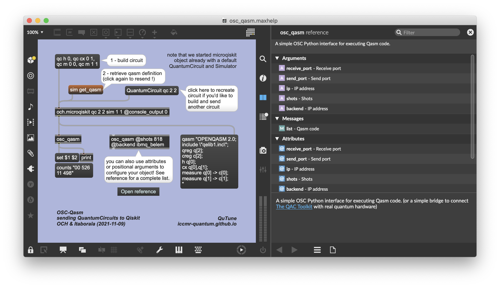
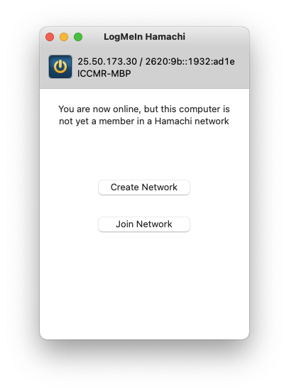
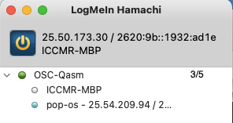

# OSC-Qasm
[](https://zenodo.org/badge/latestdoi/432225522)

A simple multi-platform OSC Python interface for executing Qasm code.
(or a simple bridge to connect _The QAC Toolkit_ with real quantum hardware)

## Installation
Before starting, make sure you have [Python](https://www.python.org/) 3.7+ in your system.
- when using the installer on windows make sure to select the option `Add Python X to PATH`

In order to try our Max patches, make sure you also have [Max](http://cycling74.com) installed, and [_The QAC Toolkit_](http://quantumland.art/qac) Max package available.

Clone or [download](https://github.com/iccmr-quantum/OSC-Qasm/archive/refs/heads/main.zip) and unzip this repo.

Open the Terminal (Mac/Linux) or Command Prompt (Windows) and navigate to the folder  where you saved the repo.
- see here a refresher on how to navigate using the terminal [[1](https://computers.tutsplus.com/tutorials/navigating-the-terminal-a-gentle-introduction--mac-3855)][[2](https://www.macworld.com/article/221277/command-line-navigating-files-folders-mac-terminal.html)]

Create a python virtual environment
- on the terminal, type: `python3 -m venv OSCQasm`
- depending on your system, you may simply use: `python -m venv OSCQasm`

Enter your new python virtual environment
- on mac/linux: `source OSCQasm/bin/activate`
- on windows: `OSCQasm\Scripts\activate`

At the start of your terminal prompt, it should show `(OSCQasm)`, indicating that you're in your new virtual environment.

Update pip and setuptools
- `pip install --upgrade pip setuptools`
- Note: if for some reason you don't have pip, please [install it](https://phoenixnap.com/kb/install-pip-windows)

Install qiskit and python-osc
- `pip install qiskit python-osc`

Copy the [osc_qasm-Max](./osc_qasm-Max/) folder to your Max library
- usually located in Documents/Max 8/Library

## Running

First, open a Terminal (Mac/Linux) or Command Prompt (Windows) and start you python environment.

Then run the python module: `python osc_qasm.py`
Wait until the program outputs the following lines:
```console
================================================
 OSC_QASM by OCH & Itaborala @ QuTune (v1.x.x)
 https://iccmr-quantum.github.io               
================================================
Server Receiving on 127.0.0.1 port PPPP
Server Sending back on x.x.x.x port QQQQ
```
Now you can open the [example.maxpat](example.maxpat) or [osc_qasm.maxhelp](osc_qasm-Max/osc_qasm.maxhelp) in Max 8 (Mac/Windows only) and start sending messages with QuantumCircuits in Qasm, to the OSC-Qasm python module.

When you're done working with osc_qasm.py you can leave the virtual environment with
- on mac/linux & windows: `deactivate`

### Additional arguments
You can also set some additional arguments and flags in front of `python osc_qasm.py`:

```console
usage: osc_qasm.py [-h] [--token TOKEN] [--hub HUB] [--group GROUP]
                   [--project PROJECT]
                   [receive_port] [send_port] [ip]

positional arguments:
  receive_port       The port where the osc_qasm.py Server will listen for
                     incoming messages. Default port is 1416
  send_port          The port that osc_qasm.py will use to send messages back
                     to Max/MSP. Default port is 1417
  ip                 The IP address to where the retrieved results will be
                     sent (Where Max/MSP is located). Default IP is 127.0.0.1
                     (localhost)

optional arguments:
  -h, --help         show this help message and exit
  --token TOKEN      If you want to run circuits on real quantum hardware, you
                     need to provide your IBMQ token (see https://quantum-
                     computing.ibm.com/account)
  --hub HUB          If you want to run circuits on real quantum hardware, you
                     need to provide your IBMQ Hub
  --group GROUP      If you want to run circuits on real quantum hardware, you
                     need to provide your IBMQ Group
  --project PROJECT  If you want to run circuits on real quantum hardware, you
                     need to provide your IBMQ Project
  --remote [REMOTE]  Declare this is a remote server. In this case osc_qasm.py
                     will be listenning to messages coming into the network
                     adapter address. If there is a specific network adapter
                     IP you want to listen in, add it as an argument here
```


The `osc_qasm.maxpat` abstraction also allows customization using several attributes and positional arguments. Make sure to check out the help patch and the reference page!



### Network Distribution

Version 1.3.0 brought new options for facilitating distributed network scenarios.

You can now have: a client machine (C1) sending `qasm` jobs via OSC (e.g. using [osc_qasm.maxpat](https://github.com/iccmr-quantum/OSC-Qasm/blob/main/osc_qasm-Max/osc_qasm.maxpat)); a different server machine (S1) running `osc_qasm.py`, receiving and processing the job requests; and even a third client machine (C2) receiving the results.

```mermaid
flowchart LR
C1 -- qasm --> S1 -- results --> C2
```

To that end, `osc_qasm.py` has an optional flag/argument called `--remote`. When used, the `osc_qasm.py` will listen to the default IP address assigned to the machine for the local area network, instead of "127.0.0.1". Additionally, you can add an argument after the flag to specify the IP address to use (useful in a scenario with multiple network adapters, each giving the machine a different IP address for each network).

Example:

```console
$ python osc_qasm.py
Server Receiving on 127.0.0.1 port 1416

$ python osc_qasm.py --remote
Server Receiving on 10.0.0.31 port 1416

$ python osc_qasm.py --remote 192.168.0.3
Server Receiving on 192.168.0.3 port 1416
```

#### Connecting worldwide
If you'd like to connect different machines across the internet, you can use their public IP, assuming also that they have open UDP ports or, in the case of a machine inside a network, they have configured the proper port forwarding. Alternatively, you can use a VPN service like [hamachi](https://vpn.net). A Setup example is shown here, with a `osc_qasm.py` server running on a Linux machine, and a `osc_qasm.maxpat` client running on a MacOS machine. We've tested this setup connecting two machines across the internet, one in Brazil, and another in the UK.

##### Linux Desktop Server
First, you need to [download](https://vpn.net) and install the CLI hamachi client. For manual installation, replace the version below with the most most up-to-date _.deb_ or _.rpm_ file shown [here](https://www.vpn.net/linux).

###### POP!OS/Ubuntu/Debian (.deb)
```console
$ wget https://www.vpn.net/installers/logmein-hamachi_2.1.0.203-1_amd64.deb
$ sudo dpkg -i logmein-hamachi_2.1.0.203-1_amd64.deb
```

###### CentOS/RedHat
```console
$ wget https://www.vpn.net/installers/logmein-hamachi_2.1.0.203-1_amd64.deb
$ sudo rpm -ivh logmein-hamachi-2.1.0.203-1.x86_64.rpm
```

This has limited capabilities, in comparison to the GUI on the Windows and MacOS versions, but the relevant configurations for our purposes can be done on any web browser.

Then, you need to create an account on [LogMeIn](https://accounts.logme.in/registration.aspx). The LogMeIn free account allows the user to setup networks on the [LogMeIn Website](https://accounts.logme.in/login.aspx).

After an account has been created, open a Terminal and log in with your account's email address, using the following commands:

```console
$ sudo hamachi login
Logging in ........... ok
$ sudo hamachi attach email@example.com
```
On the LogMeIn website, under the `My Networks` tab, click the `Add Network` button to create a new network.

<kbd>  </kbd>

Follow the steps shown on the website. In this example we created a "Mesh" type network with the name `OSC-Qasm`.

<kbd>  </kbd>

In step 2, you can configure the security settings of your network, like setting up a password and join requests settings. In step 3, you can add existing members to your network or simply click `Finish` to complete the network creation.

At this point, you can go to the Edit page of this network to copy the `Network ID`, found in the area marked by the red box.

<kbd>  </kbd>

Then, on your Linux Terminal, use the `Network ID` to join the hamachi network you created.

```console
$ sudo hamachi join NETWORK-ID
```

Once configured, you can retrieve the new hamachi network IP address by running

```console
$ sudo hamachi
  version    : 2.1.0.203
  pid        : 1464
  status     : logged in
  client id  : YOUR_CLIENT_ID
  address    : 25.54.209.94   <<<<< This is your hamachi IP address  
  nickname   : pop-os
  lmi account: email@example.com
```

Finally, assuming you also configured your client machine in the hamachi network, you can boot your `osc_qasm.py` server, using your hamachi network IP address as an argument to the `--remote` flag, and using the client machine's hamachi IP address to send the results.


Next we will show how you can configure your client machine.

##### Client MacOS machine
First, you need to [download](https://vpn.net) and install the hamachi client application. On the new `LogMeIn Hamachi` application, click the power button to enable the hamachi service.


The first time this is done, it will ask you to either log into your _LogMeIn ID_ account or create a new account. At this point the power button will be enabled and you'll be presented with 2 options: `Create Network` and `Join network`.



In this example, since we've created the network in the previous step we will just join the previously created network. It is important to note that the first field is the `Network ID` and not the network name. Once everything is set, you should see the new network listed together with its users. The led in front of each user indicates if they are online or offline. Right clicking an online user in this list will allow you to copy its IP address.



You can now open your max patch and add an attribute to `osc_qasm` object to specify the target IP address to send requests to. In this example this was done by simply adding `@ip 25.54.209.94` which is the hamachi IP address of the Linux `osc_qasm.py` server machine configured before.


## Feedback and Getting help
Please open a [new issue](https://github.com/iccmr-quantum/OSC-Qasm/issues/new).

Also, please consider learning more about Max [here](https://cycling74.com/get-started), and Qiskit [here](https://qiskit.org/learn), as well as explore the [Intro to Quantum Computer Music](https://github.com/iccmr-quantum/Intro-to-Quantum-Computer-Music) Tutorial (video recording [here](https://youtu.be/6UrNguY8zGY?t=1143)) and the other projects in [QuTune's Github](https://github.com/iccmr-quantum).

## Acknowledgements
OSC-Qasm is inspired by Jack Woehr's [Qisjob project](https://zenodo.org/record/4554481), and the och.qisjob [experimental object](https://www.quantumland.art/phd).

This repo was created by Omar Costa Hamido and Paulo Itaboraí as part of the [QuTune Project](https://iccmr-quantum.github.io/).
